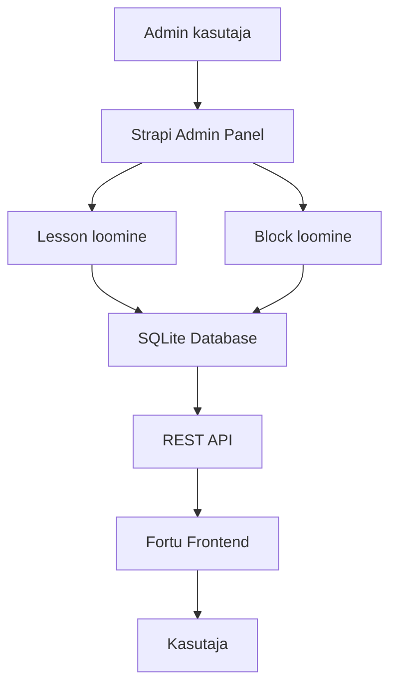

# Fortu CMS – Sisuhaldussüsteem rahatarkuse õpperakendusele

Fortu CMS on Strapi põhine sisuhaldussüsteem, mis on loodud Fortu rahatarkuse õpperakenduse õppesisu, ülesannete ja päevapõhiste lesson'ite haldamiseks.

Projekt loodi Tallinna Polütehnikumi lõputöö raames eesmärgiga eraldada õppesisu frontend rakendusest ning võimaldada sisu hallata ilma frontend koodi muutmata.

---

## Projekti Eesmärk

Fortu CMS võimaldab:

- hallata päevapõhiseid lesson'eid
- luua ja muuta õppesisu läbi admin paneeli
- lisada erinevaid ülesandetüüpe
- muuta õppesisu ilma frontend deploy't tegemata
- toetada Fortu mängustatud õpikogemust

---

## Tehnoloogiad

### Backend
- Strapi 5 – Headless CMS
- Node.js – JavaScript runtime

### Andmebaas
- SQLite – lokaalne arenduskeskkonna andmebaas

### Arendustööriistad
- npm – pakettide haldus
- Git + GitHub – versioonihaldus
- TypeScript – tüübitegelik arendus

---

## Content Model

Fortu CMS kasutab kahte peamist sisumudelit:

### 1. Lesson

Lesson esindab ühte õppemoodulit või õppeteekonna päeva.

#### Väljad

| Väli | Tüüp | Kirjeldus |
|------|------|-----------|
| `title` | Text | Lesson'i pealkiri |
| `slug` | UID | Unikaalne identifikaator |
| `order` | Number | Kuvamise järjekord |
| `blocks` | Relation | Seotud õppeplokid |

#### Näide

```json
{
  "title": "Raha ja mina",
  "slug": "day1",
  "order": 1
}
```

---

### 2. Block

Block esindab ühte õppesisu elementi või ülesannet.

#### Väljad

| Väli | Tüüp | Kirjeldus |
|------|------|-----------|
| `lesson` | Relation | Seos lesson'iga |
| `type` | Text | Ploki põhikategooria |
| `data` | JSON | Dünaamiline sisu |
| `order` | Number | Kuvamise järjekord |

#### Näide

```json
{
  "type": "activity",
  "data": {
    "subtype": "activity_text",
    "instruction": "Kirjuta kolm lauset, mis kirjeldavad sinu uut rahalist mõtteviisi...",
    "feedback": "Kui su laused tunduvad ausad ja sinu omad, oled loonud midagi väga väärtuslikku."
  },
  "order": 4
}
```

---

## Toetatud Block tüübid

### Põhitüübid
- `intro` – Sissejuhatus
- `theory` – Teooria
- `quiz` – Küsimustik
- `activity` – Tegevus
- `summary` – Kokkuvõte
- `teaser` – Eelvaade

**Märkus**: Konkreetsete alamtüüpide (nt `quiz_abcd`, `activity_text`) andmed salvestatakse `data` JSON väljale.

---

## Projekti Struktuur

```bash
fortu-cms/
├── config/              # Andmebaasi ja serveri konfiguratsioon
├── src/
│   ├── api/             # Content types (Lesson, Block)
│   ├── extensions/      # Strapi laiendused
│   └── admin/           # Admin UI seadistused
├── .tmp/               # SQLite andmebaasi failid
├── public/              # Staatilised failid
├── package.json
└── README.md
```

---

## Kiirstart

### Eeldused

- Node.js 20+
- npm

---

### 1. Klooni repositorium

```bash
git clone https://github.com/sirlikont/fortu-cms
cd fortu-cms
```

---

### 2. Paigalda sõltuvused

```bash
npm install
```

---

### 3. Käivita arendusserver

```bash
npm run develop
```

---

### 4. Ava admin paneel

```txt
http://localhost:1337/admin
```

---

## API Integratsioon

Fortu frontend kasutab CMS andmeid läbi REST API.

### Näited

#### Kõik lesson'id

```txt
/api/lessons
```

#### Lesson koos blockidega

```txt
/api/lessons?populate=blocks
```

#### Kõik blockid

```txt
/api/blocks
```

---

## Andmevoog



---

## Kasutamine koos Fortuga

Fortu CMS töötab koos Fortu frontend rakendusega.

Andmevoog:

Fortu Frontend → Strapi API → Lesson + Block data → Kasutajale kuvamine

Frontend projekt:
https://github.com/sirlikont/fortu

---

## Hetke Staatus

### Valmis
- Lesson content type loodud
- Block content type loodud
- Lesson ↔ Block relatsioon töötab
- JSON põhine dünaamiline sisu töötab
- Frontend integratsioon töötab

### Arenduses
- Admin UX täiustamine
- Sisestusvalideerimine
- Production deployment

---

## Turvalisus

### Ligipääs
- Admin paneel on kaitstud autentimisega
- Sisu muutmine ainult admin kasutajatele

### Andmed
- SQLite lokaalne andmebaas
- API ligipääsu kontroll läbi Strapi permissionite

---

## Deploy

Hetkel töötab projekt ainult lokaalses arenduskeskkonnas.

Tootmiskeskkonna deploy ei ole veel seadistatud.

---

## Autoriõigus

© 2026 Sirli Kont. Kõik õigused kaitstud.

Selle projekti lähtekoodi, andmestruktuuri, õppesisu ja disaini ei tohi ilma autori kirjaliku loata kopeerida, levitada ega kasutada.

---

## Autor

Sirli Kont  
Tallinna Polütehnikum  
Tarkvaraarendus, lõputöö 2026  

GitHub: https://github.com/sirlikont

---

## Repositoriumid

Frontend:
https://github.com/sirlikont/fortu

CMS:
https://github.com/sirlikont/fortu-cms